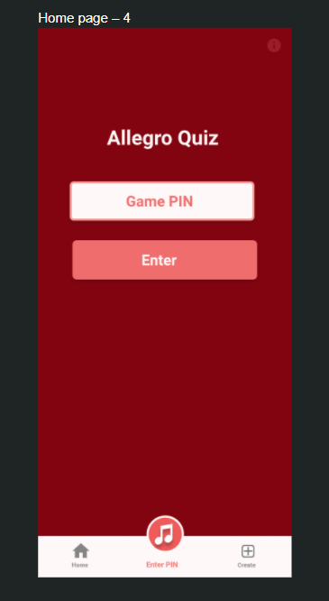
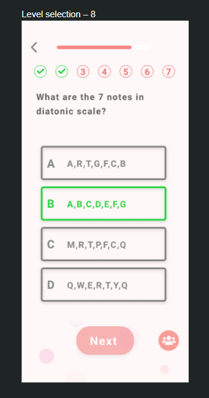
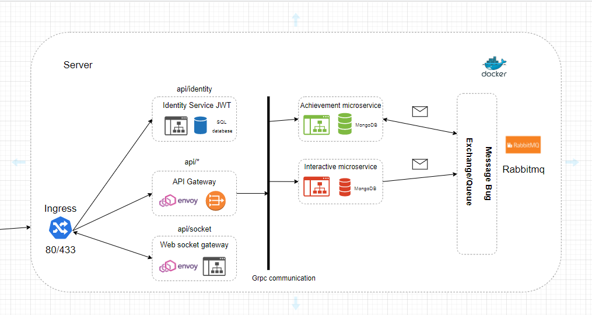

# Allegro Quiz Design
Design of the Allegro Quiz App

Repository for design specification for the Allegro Quiz App. This is where new project specification are developed and specified.

# Contents

- [Collaborative tools](#collaborative-tools)
    - [Versioning control](#versioning-control)
    - [Discord](#discord)
- [Design](#design)
    - [UI](#ui)
    - [Architecture](#architecture)
- [Development](#development)
    - [Frontend](#frontend)
    - [Backend](#backend)
- [Testing](#testing)
- [Logging and tracing](#logging-and-tracing)
- [Deployment](#deployment)
    

## Collaborative tools

### Versioning control

We are using GitHub to host

- Code source
- Design
- Meetings
- Proposal

It allows us to manage the workflow of the project and plan the features that we are
going to implement into the project. In addition, we use versioning control to record
the meetings so that we can see what have been done or discuss in a determinate day.

### Discord

We are using Discord to:

- Voice meeting
- Sharing ideas
- Sharing images
- Sharing resources

Discord plays a key part on the project design because it allows us to have meetings
and share our ideas.

## Design

### UI

### Architecture

The architecture used are:

- Microservices
  - We use microservices because it allows to decouple the logic of the app, in addition
    it allows to have a scalable system
- Messaging pattern
  - We are using the messaging pattern because it allows to use events whenever the
    user interact with the app or whenever we need to send events to the clients
- Domain Driven Design
  - We are using the domain driven design because it allows to understand the domain
    problems, but the design we currently use could change based on the problems we
    will face in the future.

Below a first draft of how the app could work with the different components

## Development

A list of technologies we use for the app

### Frontend

- React & React Native 
  - We use react to ship the app to the end user 
- @microsoft/signalr
  - Package used to keep a websocket connection between the server and the client
- Expo
  - Used to develop and build the React native project

### Backend

- ASP.NET 5
  - Core part of the app
- ASP.NET SignalR & WebSocket
  - Websocket server that manages the connection between the server and client, in 
    addition it received and send quizzes events
- Websocket and REST
  - The websocket server is used to tell the clients about events happening, and 
    the REST server is used to create quizzes and start games 
- Event Bus
  - The event bus is used to dispatch quizzes events, for example when a quiz starts
    or when it ends
- MassTransit
  - Used to connect to RabbitMQ and dispatch event
- gRPC
  - Internal communication between microservices using protobuf
- Redis
  - Used to keep the state and data protection keys
- MongoDB
  - Used to keep the quiz data

## Testing

A list of tests we use:

- Unit test
  - We use unit test before publishing the app, so we can avoid some issues in 
    production
    
## Logging and tracing

The technologies we use for logging and tracing

- Serilog
  - Allows to log errors and discover potential bugs before the app is shipped
- Datadog
  - Used to collect metrics and monitor the kubernetes cluster

## Deployment

- Docker
    - Allows to have an invariant development/production environment
- Kubernetes
    - Manages the orchestration of the different docker images and automatically
      scale up or down the pods based on the traffic

### The business case has changed... the old business case will be updated soon

## Business case

The purpose of our project is to provide a platform where people that are interested in the theory of classical music can study and learn about all aspects to it. The application will provide an easier method to their learning as all the content would be sectioned and explained thoroughly. That’s the purpose of the development of my music theory application. This product is necessary because it makes the learning of music theory easier because people can view the application whenever they want. The application will detail the fundamentals of music theory from beginner, intermediate and advanced and the structure will be clear and the explanation so people can have a better time understanding the nature of music theory. it’ll strictly focus on traditional diatonic harmony, which is the foundation of western music. Learning music theory is an extremely complicated subject and it’s difficult to grasp, this application is intended to reduce the level of difficultly through its interactive features, modern interface, and clear explanation. This method to learn music theory should hopefully encourage users to that are interested in music to study the fundamentals of music theory and even possibly engage in composition. 

## Objectives

The Aims & Objectives for our project are to create a modern platform where people who are interested in learning traditional diatonic harmony can use a mobile application as a basis for studying. It’s an attempt to make learning music theory easier as it’s the concepts explained through text and visual illustrations. I’ll be organising the stages of the project and through using the Waterfall Model, which allows me to break down the project into smaller steps so there’s a clear focus on what’s happening with the project. The stages are going to be five as it's based off the Waterfall Model so there will be “Requirements”, “Design”, “Implementation”, “Verification” and “Maintenance”. We’ll just be demonstrating what’s detailed in the process with the first three stages. The “Requirements” is where I’ll be gathering all the information required for the project, which is the main content and software as those are the essential parts for the project, without these, there wouldn’t be a project to create the software or an idea to develop. The “Design” aspect of the project would involve the design of the mobile application interface, so this is where it will user interface, font, colours will be worked on. Design also the development of the mobile application itself so it will be created with Android Studio as it’s going to be operating on Android. This process would be programming the application so that the features and functions that were detailed in the “Requirements” section is functioning as intended. The “Implementation” stage is where we’ll be incorporating the requirements into an actual prototype model, the requirements are the features and functionality of the mobile application, the designs like the mobile user interface, font styles and colour scheme.  

## Project Boundaries

-	The target audience of the project is going to be people who would like to learn music therefore the boundaries of this project will affect only them, and others audience are out of scope.

-	The target audience for this application is individuals who interested in learning music theory, which is based off traditional diatonic harmony, the content will be structured from beginner, intermediate and advanced levels so there’s going to be a lot of material for them to learn when using this mobile application. 
